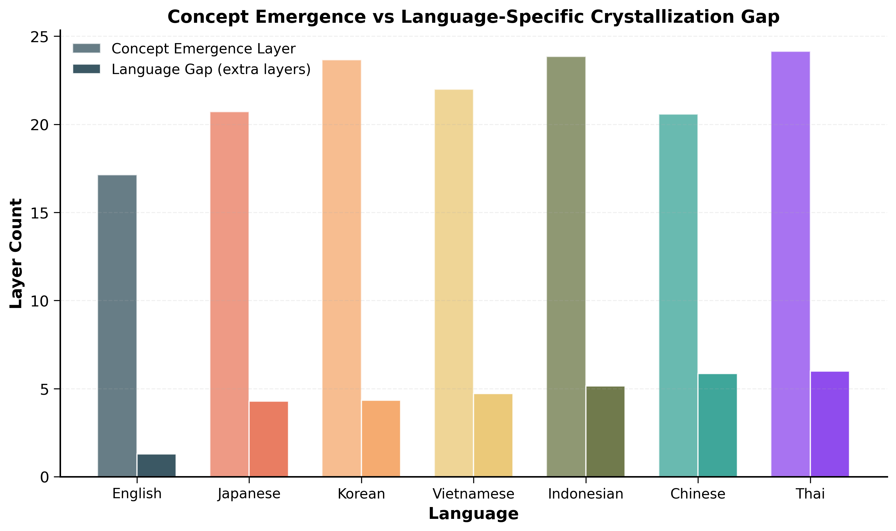
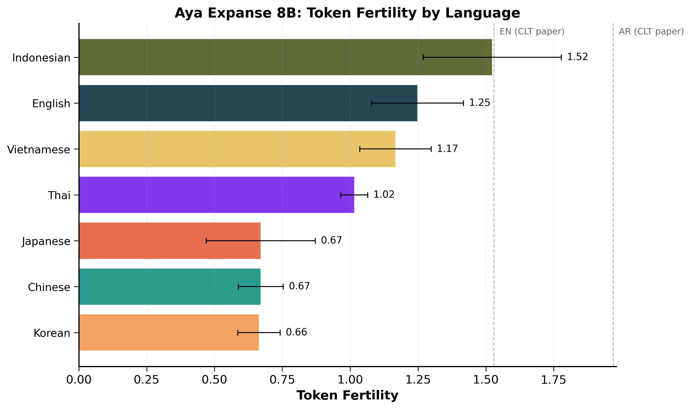
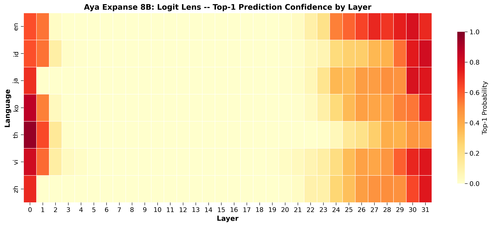
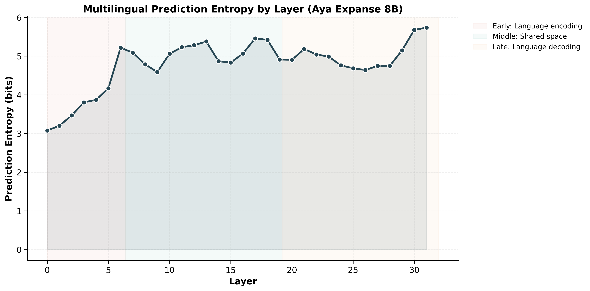
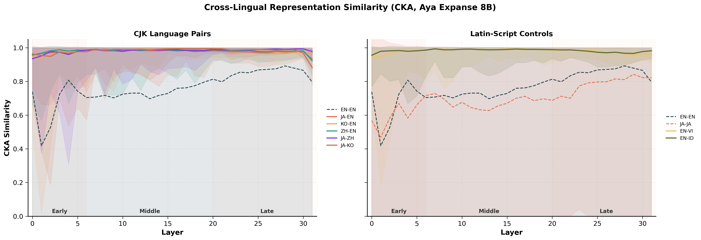

# Multilingual Representation Analysis: Aya Expanse 8B

- **Date**: 2026-02-04  
- **Author**: Jarrod Barnes  
- **Source data**: `outputs/tables/` (generated), `docs/figures/` (frozen). Every number traces to a CSV or published paper.

---

## Executive Summary

This analysis uses interpretability methods to understand how Aya Expanse 8B processes multilingual content internally, with Japanese (JA) and Korean (KO) as the primary case study. The goal is to identify whether observed CJK (Chinese/Japanese/Korean) performance gaps originate from representation quality or output decoding. Other languages tested: English (EN), Chinese (ZH), Vietnamese (VI), Indonesian (ID), Thai (TH).

**Core finding**: The model understands Japanese. It struggles to say it.

*Figure: average extra layers needed after the model “knows” the concept to produce the correct language. Higher bars mean more decoding effort before the correct surface form appears.*

CKA (Centered Kernel Alignment) measures whether neural network representations share the same geometric structure, independent of coordinate system. Applied to Aya's hidden states across languages, CKA shows that internal representations are already highly aligned for all tested languages (EN, JA, KO, ZH, VI, ID, TH) at every layer depth. The CJK deficit materializes only in the final layers where the model maps representations to language-specific surface forms. Aya's multilingual processing pipeline follows the expected three-phase pattern (encoding → shared space → decoding), confirming the architecture is sound.

| Diagnostic | Result | Interpretation |
|------------|--------|----------------|
| CKA (layers 0-30) | 0.93-0.99 for all CJK-EN pairs | Shared representational geometry |
| CKA (layer 31) | CJK pairs dip; JA-KO dips most | Divergence confined to final layer |
| Language gap (logit lens) | Non-EN languages require 3-6 extra layers | Late-layer decoding tax |
| Tokenizer | Zero byte-fallback across all languages | Input handling is functional |
| Entropy curve | Matches three-phase CLT prediction | Architecture is correct |

**Key finding for training strategy**: JA-KO shows larger late-layer divergence than JA-EN. Japanese and Korean appear to compete for decoding resources more than either competes with English. Joint JA/KO training may show interference that separate language tracks would avoid.

**Implications**: This is a representation vs. decoding distinction. Interventions that target internal representations (continued pretraining, broad LoRA) would modify parameters that are already correct. The bottleneck is at the periphery: tokenizer efficiency and output head precision. TranslateGemma (Google 2026) demonstrates a successful recipe for this profile: frozen embeddings during SFT to preserve aligned representations, followed by RL with entity preservation in the reward model.

**Business implication**: The fastest ROI path for CJK quality is likely late‑stage decoding and tokenizer/output‑head work, not expensive end‑to‑end re‑pretraining. This targets the defect directly, reduces inference waste from extra decoding layers, and improves enterprise‑critical translation and instruction fidelity without destabilizing the core representation space.

For post‑training, this points to decoding‑stage work (output head precision + reward design) as the lowest‑risk, highest‑ROI lever.

**Recommended next step**: Prioritize decoding‑stage improvements (output head + tokenizer + RL reward design) and explicitly measure JA/KO interference in late layers to validate that targeted fixes reduce the gap without collateral regressions.

The sections below present the full technical analysis.

---

## Background: Aya Expanse 8B Published Performance

For context on where Aya stands relative to comparable models. Published benchmarks show a split profile:

| Benchmark | Aya Expanse 8B | Gemma 2 9B | Qwen 2.5 7B | Llama 3.1 8B |
|-----------|---------------|-----------|-------------|-------------|
| m-ArenaHard (win-rate) | **60.4%** | baseline | 55.7% | 70.6% |
| Global-MMLU (5-shot) | 53.7 | **62.6** | **62.8** | 54.5 |
| MGSM math (5-shot) | **67.0** | 59.6 | 55.1 | 63.0 |
| FLORES chrF++ | **57.2** | 57.0 | 42.8 | 53.7 |
| FLORES xCOMET | **93.2** | 91.8 | 71.9 | 88.4 |

*Source: Dang et al. 2024, arXiv:2412.04261*

Aya leads on generation (m-ArenaHard), multilingual math (MGSM), and translation (FLORES), but trails on Global-MMLU knowledge benchmarks (-8.9 vs Gemma 2). This split -- strong fluency, weaker factual depth -- is relevant context for interpreting the interpretability results below.

### Per-Language m-ArenaHard Win-Rates (Aya Expanse 8B vs Gemma-2 9B)

From Figure 4 of the Aya Expanse paper ([arXiv:2412.04261](https://arxiv.org/abs/2412.04261)):

| Language | Win | Loss | Tie | Net Win |
|----------|-----|------|-----|---------|
| Arabic | 69.0% | 29.0% | 2.0% | +40.0 |
| Hindi | 64.6% | 34.0% | 1.4% | +30.6 |
| Turkish | 60.4% | 38.6% | 1.0% | +21.8 |
| French | 58.0% | 38.8% | 3.2% | +19.2 |
| **Korean** | **56.4%** | **41.2%** | **2.4%** | **+15.2** |
| **Japanese** | **55.6%** | **42.6%** | **1.8%** | **+13.0** |
| Chinese | 55.2% | 42.2% | 2.6% | +13.0 |
| English | 54.4% | 42.8% | 2.8% | +11.6 |

Two patterns worth noting:

1. **Uneven language investment.** Arabic net win is +40; JA/KO net win is +13-15. Aya's advantage over Gemma 2 is 3x larger for Arabic than for JA/KO.

2. **Relative comparison vs absolute quality.** A 55.6% JA win-rate means Aya's JA is slightly better than Gemma's JA -- it doesn't establish whether either model's JA output meets enterprise requirements. The interpretability analysis below examines the internal mechanics.

---

## 1. Is the Tokenizer the Bottleneck for JA/KO?

**Finding**: No. Aya's tokenizer handles CJK well. The bottleneck is downstream.

Cross-Layer Transcoders (CLTs) are sparse autoencoders that decompose transformer hidden states into interpretable features while tracking how those features flow across layers. Unlike standard sparse autoencoders that analyze one layer at a time, CLTs use cross-layer decoders to trace feature evolution from early to late layers, enabling direct measurement of where semantic concepts form and where language-specific decoding occurs. Harrasse et al. (2025) train CLTs on multilingual GPT-2 models to demonstrate that multilingual processing follows a three-phase pattern: early layers perform language-specific encoding, middle layers converge to a shared semantic space, and late layers diverge again for language-specific decoding. Their analysis provides a mechanistic reference point for interpreting the empirical results below.

The CLT paper (Appendix K) identifies tokenization as "the primary bottleneck for non-English performance" in their analysis of multilingual GPT-2 models. Arabic morpheme coherence was 0.10 vs English at 0.42, forcing early layers to spend compute on reassembly. This makes tokenizer quality the first diagnostic to check on any multilingual model.

### Token Fertility

*Source: `outputs/tables/tokenizer_fertility.csv`*

| Language | Metric | Mean Fertility | Byte Fallback | N Samples |
|----------|--------|---------------|---------------|-----------|
| English | tokens/word | 1.25 | 0% | 100 |
| Vietnamese | tokens/word | 1.17 | 0% | 100 |
| Indonesian | tokens/word | 1.52 | 0% | 100 |
| Japanese | tokens/char | 0.67 | 0% | 1000 |
| Korean | tokens/char | 0.66 | 0% | 100 |
| Chinese | tokens/char | 0.67 | 0% | 100 |
| Thai | tokens/char | 1.02 | 0% | 100 |

*CJK/Thai measured in tokens/char (no word boundaries); Latin-script languages in tokens/word. Not directly comparable. Entity splitting below provides the controlled comparison. JA fertility measured on 1,000 real instruction samples from [izumi-lab/llm-japanese-dataset](https://huggingface.co/datasets/izumi-lab/llm-japanese-dataset) (quiz, Wikipedia, dialogue, technical text). Other languages measured on FLORES+ devtest samples.*

Zero byte-fallback across all 7 languages. Every character is handled by learned subword units. This rules out the CLT paper's worst-case scenario. Aya's tokenizer is more efficient than the GPT-2 tokenizer in the CLT paper (English fertility 1.25 vs 1.53 tokens/word).

### Entity Splitting: Controlled Cost Comparison

*Source: `outputs/tables/entity_splitting.csv`*

| Entity | EN | JA | KO | ZH |
|--------|----|----|----|----|
| Fujitsu | 2 | 2 | 4 | 2 |
| Toyota | 1 | 1 | 3 | 2 |
| Samsung | 1 | 3 | 1 | 1 |
| LG Electronics | 2 | 5 | 2 | 2 |
| Hyundai | 2 | 2 | 1 | 1 |
| Huawei | 2 | 2 | 2 | 2 |
| Tencent | 2 | 2 | 2 | 1 |
| **Average** | **1.71** | **2.43** | **2.14** | **1.57** |

JA entity names require 42% more tokens than English. KO requires 25% more. ZH is 8% more efficient. Worst case: "LG Electronics" in katakana (LG Electronics) takes 5 tokens vs 2 in English, a 2.5x penalty from katakana fragmentation.

This overhead increases inference cost and consumes context window, but it is bounded and addressable through vocabulary expansion -- not a fundamental architectural issue.

### Script-Mixing Behavior

*Source: `outputs/tables/script_mixing.csv`*

| Mixed-Script Text | Tokens |
|-------------------|--------|
| HTTPS requires port 443 (JA) | 8 |
| Configure HTTPS with SSL certificate (ZH) | 5 |
| Set API key (KO) | 6 |
| Configure HTTPS with port 443 (VI) | 10 |
| Set up HTTPS on port 443 (TH) | 19 |

Aya keeps ASCII terms intact (HTTPS, 443, API) across all scripts. Thai is the outlier at 19 tokens for equivalent content, confirming character-level fragmentation as a severe bottleneck for Thai but not JA/KO.

### Diagnostic Conclusion

Aya's tokenizer is not the bottleneck for JA/KO in the way the CLT paper describes for Arabic. Zero byte-fallback and reasonable fertility indicate minimal early-layer reassembly overhead. The JA/KO deficit originates downstream -- either in internal representations or late-layer decoding. The following sections distinguish between these two possibilities.

---

## 2. Where in the Network Do Non-English Languages Fall Behind?

**Finding**: In late layers. All non-English languages require extra layers after concept understanding to produce the correct surface form.

The logit lens projects hidden states at each layer through the unembedding matrix, revealing when the model "knows" the answer (concept emergence: correct answer enters top-10) vs when it commits to a language-specific surface form (crystallization: target-language answer reaches top-1). The difference is the **language gap** -- layers spent on language-specific decoding beyond semantic understanding.

### Detection Methodology

For languages with multi-token targets (KO, VI, ID, TH, and 3/6 JA targets), detection uses first-token ID matching: the first subword token of the target is matched against top-k token IDs. This handles cases like JA cold (tokenized as [kanji, hiragana]) by detecting the kanji character in top-k, which indicates the model has the semantic concept before committing to the full inflected form. A pre-flight tokenization check (`target_tokenization.csv`) documents all multi-token targets and their decompositions.

### Results on 6 Antonym Pairs

*Source: `outputs/tables/logit_lens_summary.csv`*

Language gap (crystallization layer - emergence layer) across 6 antonym pairs:

| Language | large/small | hot/cold | fast/slow | good/bad | long/short | high/low | Mean | Range |
|----------|:-----------:|:--------:|:---------:|:--------:|:----------:|:--------:|:----:|:-----:|
| English  | 0           | 4        | 0         | 1        | 2          | 1        | 1.3  | 0-4   |
| Japanese | 4           | 2        | 10        | 7        | 1          | 0        | 4.0  | 0-10  |
| Korean   | 2           | --       | 6         | 9        | 5          | 2        | 4.8  | 2-9   |
| Chinese  | 1           | 0        | 12        | 8        | 3          | 9        | 5.5  | 0-12  |
| Vietnamese | 6         | 9        | 8         | 2        | 6          | 0        | 5.2  | 0-9   |
| Indonesian | 4         | 2        | 0         | 5        | 6          | 4        | 3.5  | 0-6   |
| Thai     | 10          | 5        | 1         | 8        | --         | --       | 6.0  | 1-10  |

*KO hot/cold: no emergence detected (first token is a byte fragment). TH long/short and high/low: emergence detected but no crystallization within 32 layers. "--" = unmeasurable.*

Three patterns emerge:

**1. Every non-English language pays a decoding tax.** English averages 1.3 extra layers; all other languages average 3.5-6.0. The gap is consistent across semantic content.

**2. High variance within each language.** JA ranges from 0 (high/low) to 10 (fast/slow). ZH ranges from 0 (hot/cold) to 12 (fast/slow). The language gap depends on the specific concept, not just the language -- some semantic domains have stronger cross-lingual representations than others.

**3. This is a CJK-wide phenomenon, not JA-specific.** ZH mean gap (5.5) exceeds JA mean gap (4.0). The deficit is systemic to CJK scripts.

### Detailed Results: Selected Antonym Pairs

*Prompt: "The opposite of 'X' is '" in each language*

**large/small** (original pair):

| Language | Emergence | Crystallization | Gap | Final Prediction |
|----------|:---------:|:---------------:|:---:|:----------------:|
| English  | 16        | 16              | 0   | "small"          |
| Chinese  | 20        | 21              | 1   | small (ZH)       |
| Japanese | 20        | 24              | 4   | small (JA)       |
| Korean   | 27        | 29              | 2   | small (KO)       |

**fast/slow** (largest gaps):

| Language | Emergence | Crystallization | Gap | Final Prediction |
|----------|:---------:|:---------------:|:---:|:----------------:|
| English  | 16        | 16              | 0   | "slow"           |
| Chinese  | 18        | 30              | 12  | slow (ZH)        |
| Japanese | 21        | 31              | 10  | slow (JA)        |
| Korean   | 23        | 29              | 6   | slow (KO)        |

**high/low** (smallest gaps):

| Language | Emergence | Crystallization | Gap | Final Prediction |
|----------|:---------:|:---------------:|:---:|:----------------:|
| English  | 20        | 21              | 1   | "low"            |
| Japanese | 21        | 21              | 0   | low (JA)         |
| Korean   | 21        | 23              | 2   | low (KO)         |
| Chinese  | 21        | 30              | 9   | low (ZH)         |

The high/low pair shows JA achieving zero gap (the target is a single token in Aya's vocabulary), while ZH requires 9 extra layers for the same concept. This reversal from the aggregate pattern demonstrates that single-pair measurements can be misleading in either direction.

### Korean: Measurable but Constrained

With first-token ID matching, Korean produces measurable emergence and crystallization in 5 of 6 pairs. KO mean gap (4.8 layers) is between JA (4.0) and ZH (5.5).

However, Korean faces a tokenization constraint that JA and ZH do not: all 6 KO targets decompose into 2-4 tokens, often at the byte level. For hot/cold, the Korean word tokenizes as [byte, byte, suffix], making the first "token" a meaningless byte fragment. No emergence can be detected for such targets because the byte fragment could appear in top-k for reasons unrelated to the Korean word.

This means KO's measured gaps (5/6 pairs) are likely understated -- the one pair that failed is the one with the worst byte-level fragmentation.

### Day-of-Week Sequence

*Source: `outputs/tables/logit_lens_summary.csv` (day_sequence category)*

| Language | Emergence | Crystallization | Gap | Final Prediction |
|----------|:---------:|:---------------:|:---:|:----------------:|
| English  | 10        | 11              | 1   | "Friday"         |
| Japanese | 24        | 30              | 6   | Friday (JA)      |
| Korean   | 28        | 30              | 2   | Friday (KO)      |
| Chinese  | 22        | 30              | 8   | Friday (ZH)      |
| Vietnamese | 28      | 30              | 2   | Friday (VI)      |
| Indonesian | 15      | 30              | 15  | "J"              |

Day sequence shows a different pattern: English emerges very early (layer 10), while all other languages cluster at layers 22-28 for emergence but share a common crystallization at layer 30. This suggests "Friday" is deeply embedded in English representations, while other languages must route through the shared concept space before producing language-specific day names.

### What the Language Gap Tells Us

The language gap localizes the deficit to late layers, but doesn't yet distinguish between two possible causes: (a) the model lacks good CJK representations in those layers, or (b) the model has good representations but struggles to map them to surface tokens. Section 4 (CKA analysis) resolves this.

The CLT paper's model-diffing analysis (Section 4.3) provides relevant context: when models are adapted for a new language, the largest parameter changes occur in late layers -- layer 11 (final layer) shows the most transformation in their 12-layer GPT-2 experiments.

The high variance across word pairs (0-12 layers) indicates that evaluation should measure per-domain performance, not just aggregates.

---

## 3. Does Aya Have the Right Multilingual Processing Pipeline?

**Finding**: Yes. Aya exhibits the three-phase processing pattern predicted by CLT theory.

Harrasse et al. (2025) demonstrate that multilingual models develop a characteristic processing pipeline, visible as a multilingual entropy curve: entropy rises in early layers (language-specific encoding), falls in middle layers (shared semantic space), and rises again in late layers (language-specific decoding). This pattern is robust across model sizes (177M GPT-2, 1B LLaMA-3.2) and training mixtures (20%-90% English). Testing whether Aya follows this pattern validates that its multilingual architecture is fundamentally sound.

### Aya Expanse 8B Entropy Curve

*Source: `outputs/tables/multilingual_entropy.csv` (70 prompts across 10 categories)*

| Phase | Layers | Entropy | Interpretation |
|-------|--------|---------|----------------|
| Encoding | 0-6 | 3.08 -> 5.22 (peak) | Language-specific input processing |
| Plateau | 6-18 | 5.22 -> 5.42 (fluctuating) | Broad high-entropy transition zone |
| Shared space | 18-27 | 5.42 -> 4.75 (trough) | Convergence to multilingual semantics |
| Decoding | 27-31 | 4.75 -> 5.73 | Language-specific output generation |

With 70 prompts (doubled from the initial 35), the entropy curve shows a clearer picture than the original run. The early rise (layers 0-6) and late rise (layers 28-31) are consistent with the CLT paper's three-phase prediction. The middle section (layers 6-28) shows a broad fluctuating plateau that descends gradually rather than a sharp trough, reflecting the greater diversity of prompt types in the expanded set.

The late-layer entropy spike (layers 29-31, rising from 5.15 to 5.73) aligns with the logit lens finding that crystallization typically occurs in layers 21-31 for non-English languages. This is where the model commits to language-specific surface forms, and the sharp entropy increase confirms that predictions diverge rapidly across languages in this region.

Aya's architecture supports multilingual processing correctly. The pipeline is not broken -- the CJK deficit identified by the logit lens (Section 2) occurs within a correctly-structured processing flow. The remaining question is whether the late-layer deficit reflects missing representations or imprecise output mapping. Section 4 addresses this directly.

---

## 4. How Similar Are CJK Representations to English in Aya?

**Finding**: Extremely similar. CKA between all cross-language pairs is uniformly high (0.883-0.995) across all 32 layers. The CJK deficit is a decoding precision problem, not a representation quality problem.

This section applies CKA directly to Aya's hidden states. For each language pair, we run semantically equivalent prompts across 10 categories, extract the last-position hidden state at each layer, and compute debiased linear CKA with bootstrap 95% confidence intervals (1000 resamples). The debiased HSIC estimator (Song et al. 2012) is essential here: with n=10 prompts and d=4096 dimensions, standard CKA produces ~0.99 for random data due to concentration of measure. The debiased version correctly returns ~0.0 for unrelated representations.

### CKA Results

*Source: `outputs/tables/representation_similarity_summary.csv`, `outputs/tables/representation_similarity.csv`*

| Pair | Type | Mean CKA | Peak CKA (Layer) | Trough CKA (Layer) | N Prompts |
|------|------|----------|-------------------|---------------------|-----------|
| EN-EN | Same-language baseline | 0.763 | 0.892 (L28) | 0.418 (L1) | 5 |
| JA-JA | Same-language baseline | 0.700 | 0.842 (L29) | 0.469 (L1) | 5 |
| JA-EN | CJK vs English | 0.977 | 0.990 (L8) | 0.933 (L31) | 10 |
| KO-EN | CJK vs English | 0.980 | 0.995 (L15) | 0.935 (L1) | 10 |
| ZH-EN | CJK vs English | 0.979 | 0.990 (L7) | 0.923 (L31) | 10 |
| JA-ZH | CJK internal | 0.982 | 0.993 (L30) | 0.935 (L0) | 10 |
| JA-KO | CJK internal | 0.981 | 0.995 (L19) | 0.883 (L31) | 10 |
| EN-VI | Latin-script control | 0.980 | 0.993 (L15) | 0.948 (L1) | 10 |
| EN-ID | Latin-script control | 0.983 | 0.993 (L7) | 0.955 (L0) | 10 |

### Interpreting CKA Values

**Why same-language baselines are lower than cross-language pairs.** Same-language baselines (EN-EN, JA-JA) compare representations of *different semantic categories* within the same language (e.g., EN antonym prompts vs EN day-of-week prompts). Cross-language pairs compare representations of the *same semantic content* in different languages (e.g., EN "the opposite of large" vs JA equivalent). The baselines answer: "how similar are same-language representations across different meanings?" This makes cross-language CKA values interpretable -- they measure shared representational structure for equivalent content.

**Why all cross-language CKA values are high.** At CKA > 0.88 across all layers for all 7 cross-language pairs, Aya has achieved strong representational alignment. All CJK-EN pairs stay >=0.93 through layer 30. When the model processes "the opposite of large" in English and the equivalent in Japanese, the hidden states at every layer share the same geometric structure. This is consistent with the Platonic representation hypothesis (Huh et al. 2024): sufficiently trained models converge on shared representations of reality regardless of input modality.

### The Late-Layer CKA Dip

The high CKA shows a subtle but mostly downward shift at the final layer:

| Pair | CKA at Layer 30 | CKA at Layer 31 | Delta |
|------|-----------------|-----------------|-------|
| JA-KO | 0.969 | 0.883 | -0.086 |
| JA-EN | 0.976 | 0.933 | -0.043 |
| ZH-EN | 0.981 | 0.923 | -0.058 |
| KO-EN | 0.973 | 0.967 | -0.006 |
| EN-VI | 0.963 | 0.958 | -0.006 |
| EN-ID | 0.977 | 0.982 | +0.005 |

CJK pairs diverge more at layer 31 than Latin-script controls. JA-KO shows the largest drop (-0.086), suggesting Japanese-Korean divergence in the final decoding layer is more pronounced than any single CJK-English pair. Latin-script controls (EN-VI, EN-ID) barely move; EN-ID slightly increases, indicating the late-layer dip is concentrated in CJK pairs.

This late-layer dip is small relative to the overall CKA level (lowest layer-31 values are ~0.88-0.93 vs ~0.97-0.98 mean), but it corroborates the logit lens finding: layers 29-31 are where CJK language-specific decoding happens. The CKA dip localizes the divergence to exactly the layers where the language gap materializes.

### What CKA Reveals About the Deficit

The CKA results resolve the ambiguity from Section 2. The logit lens showed a late-layer decoding tax; CKA shows that tax is not due to missing representations:

1. **Middle layers are functioning correctly.** CKA is ~0.98 in layers 7-20. Aya's shared semantic space works for CJK languages.

2. **JA-KO shows the largest late-layer divergence.** The JA-KO CKA dip (0.883) exceeds any CJK-EN dip. Japanese and Korean appear to compete for late-layer decoding resources more than either competes with English.

### Relationship to CLT Feature Overlap

For context: CLT feature overlap analysis on 177M-parameter GPT-2 models (Harrasse et al. 2025) shows 3-9% Jaccard similarity for CJK-European pairs vs 15-27% for European-European pairs. This doesn't contradict the high CKA results -- CKA measures representational geometry (which can be similar even when individual features differ), while Jaccard measures feature-level overlap. Both can be true: the model uses different features to represent the same concept in different languages, but those features produce geometrically equivalent hidden states.

---

## 5. Synthesis: Representation vs. Decoding

The four preceding sections converge on a single diagnostic conclusion:

| Section | Finding | Points to |
|---------|---------|-----------|
| 1. Tokenizer | Zero byte-fallback; bounded overhead | Input handling is functional |
| 2. Logit lens | Non-EN languages require extra layers | Late-layer decoding tax |
| 3. Entropy | Three-phase curve matches theory | Pipeline is architecturally correct |
| 4. CKA | 0.883-0.995 at all depths | Representations aligned |

**The deficit is at the periphery, not the core.** Aya's internal representations encode equivalent semantic content for JA/KO and EN (CKA > 0.88 across all cross-language pairs; CJK-EN stays >=0.93 through layer 30). The decoding tax for CJK languages materializes in the final steps where those representations map to surface tokens.

This is consistent with CLT mechanistic analysis on smaller models. Language switching experiments at 177M scale show that language and semantics are mechanistically separable -- you can suppress one language's late-layer features and boost another's to change output language while preserving meaning. The feature-level machinery for language-specific decoding exists; CKA shows Aya has already built the shared semantic foundation that such machinery operates on.

---

## Implications for Model Development

The findings above have direct consequences for how we think about multilingual improvement across training stages.

### Pre-training Considerations

The tokenizer works but has room for improvement. Zero byte-fallback means all characters are handled, but JA entities incur overhead (Section 1) and KO targets decompose to byte-level fragments. The CLT paper (Appendix K) establishes that morphological coherence matters more than vocabulary size -- units that align to meaningful boundaries outperform raw vocabulary expansion.

CKA shows the current pretraining recipe builds aligned representations. The MMLU gap (-8.9 vs Gemma 2) suggests the issue is knowledge depth in JA/KO, not representation quality.

### Mid-training Considerations

The mid-training literature (Tu et al. 2025, arXiv:2510.23081) distinguishes mid-training from continued pretraining: mid-training preserves optimizer state and blends the original distribution (70-75%) with new domain content (25-30%). Pure CPT risks degrading task performance while improving domain knowledge.

CKA provides confidence that mid-training can inject JA/KO domain content without disrupting alignment, as long as the original distribution is preserved. The JA-KO late-layer divergence (Section 4) suggests joint JA/KO training may show interference that separate language tracks would avoid.
In other words, mid-training is the lever for coverage and knowledge depth, while decoding precision is better addressed in post-training.

### Post-training Considerations

TranslateGemma (Google 2026) demonstrates a successful SFT+RL recipe for multilingual improvement:
- Frozen embeddings during SFT (CKA confirms early layers are aligned)
- 70% parallel data + 30% generic instruction data
- RL with 5-reward ensemble including token-level AutoMQM spans

Their sole human evaluation regression was JA->EN named entity mistranslation (MQM 13.4 vs 11.6). Given Section 1's finding on JA entity tokenization overhead, entity preservation metrics warrant explicit inclusion in any RL reward model.

TranslateGemma's 27B model improved en->ja MetricX from 4.30 to 3.53 (17.9% gain) without touching internal representations -- consistent with CKA evidence that the bottleneck is at the periphery.

### Business Implications

For applied model development, the results prioritize interventions that preserve the aligned representation space while sharpening decoding for CJK. That implies focusing on output head precision, tokenizer efficiency, and reward design (entity preservation, format fidelity) rather than large‑scale pretraining changes. This minimizes risk to global quality, shortens iteration cycles, and aligns investment with the specific failure mode observed in production‑relevant languages.
It is also the lowest‑risk cost path versus full retraining: it avoids destabilizing global quality while directly addressing the observed decoding failure mode.

### Tracking Metrics

| Metric | Current Baseline | Interpretation |
|--------|------------------|----------------|
| CKA at layer 31 (JA-EN) | 0.933 | Late-layer alignment quality |
| CKA at layer 31 (JA-KO) | 0.883 | JA/KO interference signal |
| Language gap (JA, N=6) | 4.0 layers (range 0-10) | Decoding overhead |
| JA entity token cost | +42% vs EN | Tokenizer efficiency |
| Byte-fallback rate | 0% | Vocabulary coverage |

---

## Appendix A: Methodology

### Models

| Model | Parameters | Architecture | Role |
|-------|-----------|-------------|------|
| Aya Expanse 8B | 8B | CohereForCausalLM (32 layers) | Sections 1-5: all empirical analysis |

CLT feature overlap and language switching results (referenced in Sections 4-5 for context) were computed on GPT-2 Multilingual 177M models (Harrasse et al. 2025) in prior work on this codebase.

### CKA Configuration

- **Method**: Linear CKA with debiased HSIC estimator (Song et al. 2012)
- **Hidden state extraction**: last-position hidden state at each of 32 layers
- **Kernels**: linear (K = XX^T), debiased by zeroing kernel diagonals and applying correction terms
- **Bootstrap**: 1000 resamples with replacement, 95% confidence intervals (percentile method)
- **Prompts**: 10 semantic categories across 7 languages (EN, JA, KO, ZH, VI, ID, TH)
- **Language pairs**: 9 total -- 2 same-language baselines (EN-EN, JA-JA using cross-category splits, n=5 each), 5 CJK pairs (JA-EN, KO-EN, ZH-EN, JA-ZH, JA-KO, n=10 each), 2 Latin-script controls (EN-VI, EN-ID, n=10 each)
- **Caching**: cross-language hidden states are cached per language to avoid redundant forward passes. A pre-validation step asserts that all pairs using the same cache key produce identical prompt lists.
- **Sanity checks**: CKA(X, X) = 1.000 (self-similarity), CKA(X, random) = -0.053 (near zero for unrelated data)
- **Compute**: Single A100 80GB SXM4, ~4 minutes for all 9 pairs across 32 layers (70 forward passes for hidden state collection + bootstrap computation)

**Why debiased HSIC**: Standard HSIC has O(1/n) positive bias. With n=10 prompts and d=4096 dimensions, standard CKA produces ~0.99 for random data due to concentration of measure in high dimensions. The debiased estimator (Song et al. 2012) corrects this by zeroing kernel diagonals and applying three correction terms, yielding CKA ~0.0 for truly unrelated representations.

**Phase boundary note**: Early/Middle/Late annotations on the CKA figure are approximate, extrapolated proportionally from GPT-2's 12-layer architecture (Harrasse et al. 2025) to Aya's 32 layers. The actual phase boundaries in Aya are determined empirically by the entropy curve (Section 3).

### Logit Lens Detection

For multi-token targets (common in KO, VI, ID, TH, and some JA targets), detection uses first-token ID matching rather than substring search:

1. The target string is tokenized; the first subword token ID is extracted.
2. **Emergence**: first layer where this token ID appears anywhere in top-10.
3. **Crystallization**: first layer where this token ID is the top-1 prediction.
4. String-based substring matching serves as a fallback for cases where first-token ID matching does not apply.

Pre-flight tokenization verification (`target_tokenization.csv`) documents all targets, their token counts, and subword decompositions. Single-token targets: EN 7/7, ZH 6/7, JA 3/7. Multi-token targets: KO 7/7, VI 7/7, ID 7/7, TH 7/7.

### Limitations

**CKA confidence intervals for same-language baselines (n=5) are wide.** Bootstrap CIs for EN-EN and JA-JA frequently span from negative values to ~1.0, reflecting the thin sample (5 paired prompts from cross-category splits). Cross-language pair CIs (n=10) are tighter but still non-trivial. The summary statistics (mean CKA, peak/trough values) are more reliable than individual per-layer point estimates.

**CKA measures representational geometry, not feature identity.** High CKA between JA and EN means the hidden states share geometric structure, not that the model uses the same features for both languages. CLT analysis on smaller models shows 3-9% feature-level overlap for CJK-European pairs despite the geometric similarity. Both observations are consistent: different features can produce geometrically equivalent representations.

**Language gap variance is high.** Across 6 antonym pairs, individual language gaps range from 0 to 12 layers. Mean values (JA = 4.0, ZH = 5.5, KO = 4.8) are informative but do not capture the full picture. The gap depends on the specific semantic content, suggesting that some concepts have stronger cross-lingual representations than others. N=6 antonym pairs provides a meaningful distribution but is not exhaustive.

**Korean detection is constrained by byte-level tokenization.** 1 of 6 KO pairs produced no measurable emergence because the first token is a byte fragment. KO language gap statistics are computed from 5/6 pairs and may understate the true gap.

### Data Sources

| File | Contents | Used In |
|------|----------|---------|
| `tokenizer_fertility.csv` | Per-language token fertility and byte-fallback rates | Section 1 |
| `entity_splitting.csv` | Token counts for 7 entities across 4 languages | Section 1 |
| `script_mixing.csv` | Token counts for mixed-script technical text | Section 1 |
| `target_tokenization.csv` | Pre-flight target tokenization verification | Section 2 |
| `logit_lens_summary.csv` | Emergence/crystallization layers per language and category | Section 2 |
| `logit_lens_layers.csv` | Per-layer top-k probabilities for all prompts | Section 2 (heatmap) |
| `multilingual_entropy.csv` | Prediction entropy per layer across 70 prompts | Section 3 |
| `representation_similarity.csv` | Per-layer CKA for 9 language pairs (288 rows) | Section 4 |
| `representation_similarity_summary.csv` | Summary statistics for 9 language pairs | Section 4 |

### Prompt Design

10 prompt categories in 7 languages (70 prompts). 6 antonym pairs (large/small, hot/cold, fast/slow, good/bad, long/short, high/low) plus technical, named entity, structured data, and day-of-week sequence. Prompts hand-crafted for semantic equivalence. Vietnamese prompts use proper diacritical marks.

## Appendix B: References

1. Harrasse et al. (2025). "Tracing Multilingual Representations in LLMs with Cross-Layer Transcoders." arXiv:2511.10840. Sections 4.1.3 (tokenization bottleneck), 4.3 (model-diffing), Appendix K (fertility metrics).
2. TranslateGemma Technical Report (Google 2026). arXiv:2601.09012. SFT + RL on Gemma 3 for translation. Table 3 (JA->EN sole regression), Table 4 (MetricX: en->ja 4.30 to 3.53), frozen embeddings, 30% generic data mixing.
3. Tu et al. (2025). "A Survey on LLM Mid-training." arXiv:2510.23081. Mid-training vs CPT distinction, 70-75% original mix recommendation, WSD scheduler.
4. Kornblith et al. (2019). "Similarity of Neural Network Representations Revisited." Linear CKA definition and invariance properties.
5. Song et al. (2012). "Feature Selection via Dependence Maximization." Debiased HSIC estimator.
6. Huh et al. (2024). "The Platonic Representation Hypothesis." Models converge to shared reality representations.
7. Wendler et al. (2024). Logit lens analysis: English tokens predicted in middle layers of multilingual models.
8. Dang et al. (2024). "Aya Expanse: Combining Research Breakthroughs for a New Multilingual Frontier." arXiv:2412.04261.
