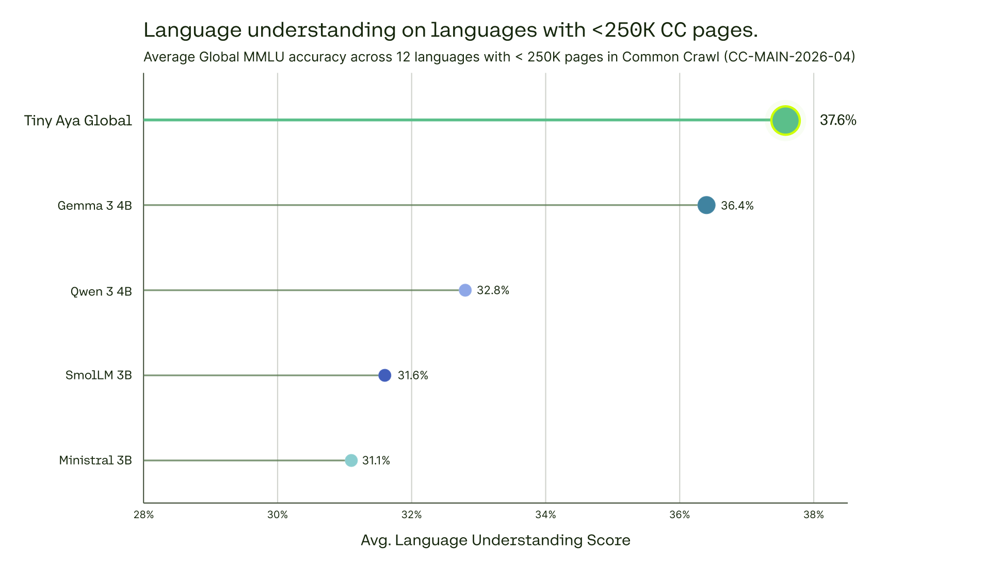
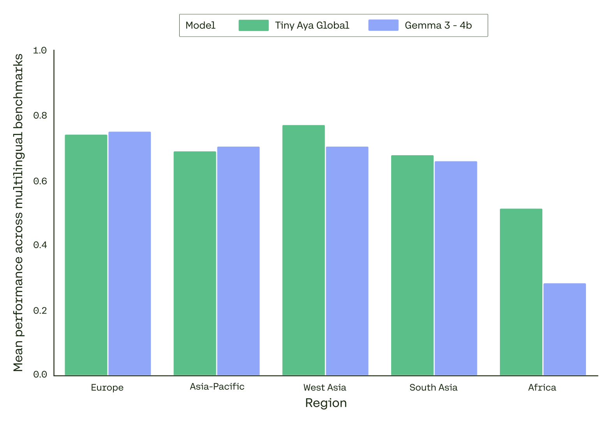
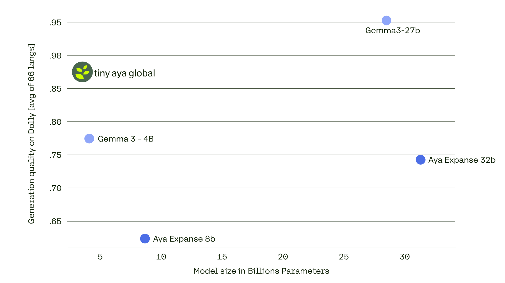

# **Model Card for tiny-aya-global**


**Best balance across languages and regions.** For other regions, check [tiny-aya-fire](https://huggingface.co/CohereLabs/tiny-aya-fire), [tiny-aya-earth](https://huggingface.co/CohereLabs/tiny-aya-earth), [tiny-aya-water](https://huggingface.co/CohereLabs/tiny-aya-water)

## **Model Summary**

Cohere Labs Tiny Aya is an open weights research release of a pretrained 3.35 billion parameter model optimized for efficient, strong, and balanced multilingual representation across 70+ languages, including many lower-resourced ones. The model is designed to support downstream adaptation, instruction tuning, and local deployment under realistic compute constraints.

Developed by: [Cohere](https://cohere.com/) and [Cohere](https://cohere.com/research) Labs

* Point of Contact: [**Cohere Labs**](https://cohere.com/research)
* License: [CC-BY-NC](https://cohere.com/cohere-labs-cc-by-nc-license), requires also adhering to **[Cohere Lab's Acceptable Use Policy](https://docs.cohere.com/docs/c4ai-acceptable-use-policy)**
* Model: tiny-aya-it-global
* Model Size: 3.35B
* Context length: 8K input

For more details about this model family, please check out our [blog post](https://cohere.com/blog/cohere-labs-tiny-aya) and [tech report](https://github.com/Cohere-Labs/tiny-aya-tech-report/blob/main/tiny_aya_tech_report.pdf).

**Try Cohere Labs Tiny Aya**

You can try out Cohere Labs Tiny Aya before downloading the weights in our hosted [Hugging Face Space](https://huggingface.co/spaces/CohereLabs/tiny-aya).

**Usage**

```py
from transformers import AutoTokenizer, AutoModelForCausalLM

model_id = "CohereLabs/tiny-aya-global"
tokenizer = AutoTokenizer.from_pretrained(model_id)
model = AutoModelForCausalLM.from_pretrained(model_id)

# Format message with the chat template
messages = [{"role": "user", "content": "Explica en español qué significa la palabra japonesa 'ikigai' y da un ejemplo práctico."}]
inputs = tokenizer.apply_chat_template(
    messages,
    tokenize=True,
    add_generation_prompt=True,
    return_tensors="pt",
    return_dict=True,
)

gen_tokens = model.generate(
    **inputs,
    max_new_tokens=4096,
    do_sample=True,
    temperature=0.3,
    top_p=0.95
)

gen_text = tokenizer.decode(gen_tokens[0])
print(gen_text)
```

You can also use the model directly using transformers `pipeline` abstraction:

```py
from transformers import pipeline
import torch

model_id = "CohereLabs/tiny-aya-global"

pipe = pipeline(
    "text-generation",
    model=model_id,
    torch_dtype="auto",
    device_map="auto",
)

messages = [
    {"role": "user", "content": "Explain the Transformer architecture"},
]
outputs = pipe(
    messages,
    max_new_tokens=300,
)
print(outputs[0]["generated_text"][-1])

```

## **Model Details**

**Input**: Text only.

**Output**: Model generates text.

**Model Architecture**: This is an auto-regressive language model that uses an optimized transformer architecture. After pretraining, this model uses supervised fine-tuning (SFT) and preference training to align model behavior to human preferences for helpfulness and safety. The model features three layers with sliding window attention (window size 4096\) and RoPE for efficient local context modeling and relative positional encoding. A fourth layer uses global attention without positional embeddings, enabling unrestricted token interactions across the entire sequence.

**Languages covered:** The model has been trained on 70+ languages, with a focus on: English, Dutch, French, Italian, Portuguese, Romanian, Spanish, Czech, Polish, Ukrainian, Russian, Greek, German, Danish, Swedish, Norwegian, Catalan, Galician, Welsh, Irish, Basque, Croatian, Latvian, Lithuanian, Slovak, Slovenian, Estonian, Finnish, Hungarian, Serbian, Bulgarian, Arabic, Persian, Urdu, Turkish, Maltese, Hebrew, Hindi, Marathi, Bengali, Gujarati, Punjabi, Tamil, Telugu, Nepali, Tagalog, Malay, Indonesian, Vietnamese, Javanese, Khmer, Thai, Lao, Chinese, Burmese, Japanese, Korean, Amharic, Hausa, Igbo, Malagasy, Shona, Swahili, Wolof, Xhosa, Yoruba, and Zulu

**Context Length:** Tiny Aya supports a context length of 8K & 8K output length.







## **Usage and Limitations**

### **Intended Usage**

Tiny Aya is a family of massively multilingual small language models built to bring capable AI to languages that are often underserved by existing models. The models support languages across Indic, East and Southeast Asian, African, European, and Middle Eastern language families, with a deliberate emphasis on low-resource language performance.

Intended applications include multilingual text generation, conversational AI, summarization, translation and cross-lingual tasks, as well as research in multilingual NLP and low-resource language modeling. The models are also suited for efficient deployment in multilingual regions, helping bridge the digital language divide for underrepresented language communities.

### **Strengths**

Tiny Aya demonstrates strong open-ended generation quality across its full language coverage, with particularly notable performance on low-resource languages. The model performs well on translation, summarization, and cross-lingual tasks, benefiting from training signal shared across language families and scripts.

### **Limitations**

**Reasoning tasks.** The model's strongest performance is on open-ended generation and conversational tasks. Chain-of-thought reasoning tasks such as multilingual math (MGSM) are comparatively weaker.

**Factual knowledge.** As with any language model, outputs may contain incorrect or outdated statements, particularly in lower-resource languages with thinner training data coverage.

**Uneven resource distribution.** High-resource languages benefit from richer training signal and tend to exhibit more consistent quality across tasks. The lowest-resource languages in the model's coverage may show greater variability, and culturally specific nuance, sarcasm, or figurative language may be less reliably handled in these languages.

**Task complexity.** The model performs best with clear prompts and instructions. Highly complex or open-ended reasoning, particularly in lower-resource languages, remains challenging.

## **Model Card Contact**

For errors or additional questions about details in this model card, contact \[labs@cohere.com\].

## **Terms of Use:**

We hope that the release of this model will make community-based research efforts more accessible, by releasing the weights of a highly performant 111 billion parameter model to researchers all over the world. This model is governed by a [CC-BY-NC](https://cohere.com/c4ai-cc-by-nc-license) License (Non-Commercial) with an acceptable use addendum, *and also requires adhering to [Cohere Lab's Acceptable Use Policy](https://docs.cohere.com/docs/c4ai-acceptable-use-policy)*. If you are interested in commercial use, please contact [Cohere’s Sales team](https://cohere.com/contact-sales).

## **Try it now:**

You can try Tiny Aya in our dedicated [Hugging Face Space](https://huggingface.co/spaces/CohereLabs/tiny-aya).
